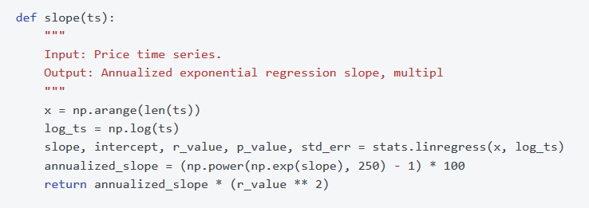
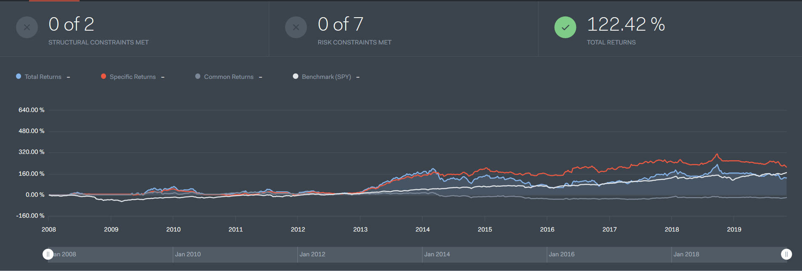

For the CASE competition, I tried implementing two quantitative strategies on the quantopian quantitative algorithmic trading platform and divided my portfolio asset allocation equally across the two strategies. A brief summary of each strategy is presented below:

1. **Exponential Regression on Momentum**

This strategy looked at momentum as an alpha factor and attempted to get linear coefficients for the log of the asset price as a time series. A snippet of the code is shown below:

As seen, the function returns the annualized slope (multiplied by the r^2 value to incorporate a confidence metric in the result). The strategy quantifies momentum in such a way over two windows: 60 and 90 days (leaving out the last 5 days), averages their momentum scores, and ranks them accordingly to choose the top 10 with the highest momentum score. For portfolio construction, these 10 assets were given equal weighting, for a long position order. It should be noted that while this can be extended to a long-short strategy by selecting the bottom ranked assets, the portfolio presented in the spreadsheet is derived from a simpler long, hold, sell strategy. The backtest is summarized below:

A drawback of this strategy is that it attempts to identify trends in market by looking at momentum, and therefore market exposure is high. In fact, over the course of this backtest, Beta to SPY500 was found to be 1.15, with a sharpe ratio of 0.38. This strategy required month to month rebalancing, and the portfolio constructed using this strategy (having 50% of the total capital allocation) is presented in the attached excel spreadsheet titled &quot;StrategyA&quot;.

1. **Momentum Crossover with News Analytics**

This strategy is again structured as a long-hold-sell strategy by quantifying momentum. However, in this strategy, rather than using an exponential regression slope, asset momentum is quantified more naively, via using moving average signals for different window lengths. Upon crossover of these signals, a buy/sell signal is generated. However, there are two more factors used in this strategy: The CBOE VIX index and financial news data from Sentdex. The buy signal is generated when there is a short-term trend spotted by the moving average windows, and the VIX close value is below a certain threshold (to prevent buying assets in a market with high expected volatility). This is done because the portfolio rebalancing occurs once a month, and although there may be opportunities to exploit the short-term volatile market through medium-high frequency trading, a conservative choice is made, and a buy signal is not triggered in a volatile market. One more factor at play here is news analytics data from Sentdex. Sentdex provides sentiment analytics on financial data for various companies. These analytics are used (in conjunction with downward momentum trends) to trigger a sell signal for equities that have a strong negative sentiment from recent news publications. A backtest for this strategy can be seen below:

Again, the major drawback here is the high market exposure with a Beta to SPY500 of around 1.1 in the backtest shown above. The sharpe ratio is more promising though, at a value of 1.11. A portfolio constructed via this strategy (having the remaining 50% of capital allocation) is presented in the attached spreadsheet titled &quot;Strategy B&quot;.

**Additional Notes:**

- Quantopian code for both these strategies is attached. In order to run the code, it must run on the quantopian platform (running it on a local python kernel will result in failure)
- Disclaimer: The code for these two strategies is taken by referencing youtube tutorials and help quantopian help forums to tweak pre-existing strategies, adding/removing factors and changing hyperparameters. The template for strategy A is taken from Andreas Clenow&#39;s quantopian blog post.
- For strategy B, none of the NLP analysis was done locally. All news sentiment data was taken from sentdex analytics: [http://sentdex.com/financial-analysis/](http://sentdex.com/financial-analysis/)